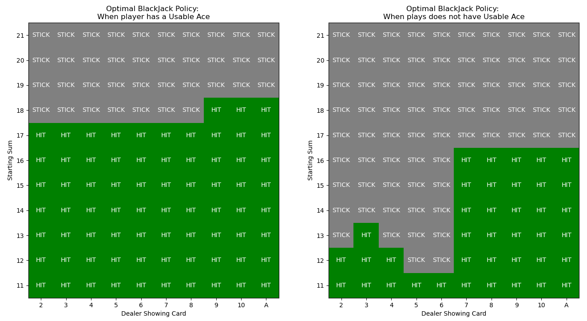

# How to Run the Notebook
1. In your terminal:
```
docker compose up
```
2. In your web browser, open `localhost:8888`
3. Enter the token `my-token`
4. Navigate into the `work/` folder, and open the `blackjack-solver.ipynb` notebook in the JupyterLab environment.

Notion blog post: [link](https://harmless-resistance-e28.notion.site/Blackjack-Solver-1414b68d0c40802caf37e73e7ad0a6d8)

# Problem Definition

Objective of the game:

- obtain cards the sum of whose numerical values is as great as possible without exceeding 21.
- All face cards count as 10, ace can count as either 1 or 11.
- Player competes independently against dealer.

Gameplay:

- Game begins with two cards dealt to both dealer and player. One of dealer's cards is face up, other is face down.
- If player has 21 immediately (Ace + 10), this is a natural and player wins unless dealer also has a natural in which case it's a draw
- Otherwise, player has two actions:
    - `Hit` (request additional card)
        - If the player exceeds 21 (goes bust), he loses
    - `Stick` (stop with current cards)
        - After stick, it becomes the dealer's turn.
- The dealer follows a fixed strategy without choice: stick on any sum 17 or greater, and hits otherwise. If dealer goes bust, player wins.
- Final outcome decided by whose final sum is closer to 21.

Assumption: cards are dealt from an infinite deck (with replacement), so that there is no advantage to keeping track of the cards already dealt.

# Results

## Optimal Play Strategy



## State Value Function (proportional to probability of winning)


- notice that in the non-usable ace (right graph), there is a upward curve near the front, particularly by the 11. I think this happens because from 11 you can get either `{10, J, Q, K}`, and make it to 21 (and 21 has a very high probability of winning).

## House Edge

We can use this value function to calculate the house edge - that is, the probability of the player winning. My estimate shows `47.3%` , which gives the house 2.7% edge in the game. 

- Note that some assumptions were made in the starting distribution of cards, and the independence assumption between the dealer’s card and the player’s starting cards (in real life, the cards that show up affect future cards)
- However, this estimate is similar to published estimates, which put variants of the game to between 48-49.7%.

# Formulation as MDP

We can formulate Blackjack as an episodic finite MDP. Each hand of Blackjack is an episode.

- Rewards: +1, -1, 0 are given for winning, losing, and drawing. All rewards within a game are 0.
- Actions: Hit or Stick
- State: Three variables (`Usable Ace`, `Player's Card's Sum` and `Dealer's Showing Card`)
    - Usable ace: if player has ace that can be used as 11 without going bust.
    - Current Sum (12-21) - since if the sum is 11 or lower the player will always hit, there is no decision to make.
    - Dealer's one showing card (ace-10)
    - Total 200 states

# On-policy Monte Carlo Algorithm with Exploring Starts

With a Monte Carlo method, we will simulate millions of hands of blackjack to find the optimal policy. We will estimate the Action-Value function, which is the expected return from a given state s, if the immediate following action is a. This estimate is given by `Q(s,a)`.

Here is the pseudocode for the algorithm:

```
Initialize:
    pi[s], arbitrarily for all s in S, a in A
    Q[s, a] = 0 for all s in S, a in A
    Count[s, a] = 0 for all s in S, a in A

Loop infinitely (for each episode):
    Choose S_0, A_0 randomly such that all pairs have probability > 0
    Generate an episode from S_0, A_0 following pi: S_0, A_0, R_1, ..., S_T-1, A_T-1, R_T
    G = 0
    Loop for each step in the episode t = T-1, T-2, ..., 0:
    G = gamma*G + R_{t+1}
    Unless the pair (St, At) appears earlier in the episode:
        Count[St, At] += 1
        Q(St, At) = Q[St, At] + 1/Count[St, At]*(G - Q[St, At]) # incremental update algorithm
        pi[St] = argmax_a Q[St, a]

```

# Representing State and Action Spaces, Policy

Since there is no decision to be made when `current_sum < 12`, the indexing will correspond to `current_sum-12`. State is a `(usable_ace, current_sum, dealer_card)` tuple. Action is an enum between `HIT = 0 , STICK = 1`. The action-value function can then be represented by a 4d numpy array: `Q[usable_ace][current_sum][dealer_card][action]`.

The policy can be represented as a 3d numpy array: `pi[usable_ace, current_sum][dealer_card] in {HIT, STICK}`.

# Performing the Iteration

To perform exploring starts, we first select a random state tuple, and random action for our S0, A0. Follow the policy `pi` until the player either goes bust or chooses `STICK`. If the player is not bust, iterate on the dealer until dealer sum is 17 or higher (or dealer goes bust). Finally, compare sums and delegate reward accordingly. All rewards until the last reward will be 0 in the episode. We will keep track of states, actions, and rewards for the entire episode as they are generated. The dealer iteration does not need to be kept track, only the final result is captured in the last reward.